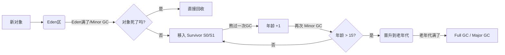

如果说 `new` 是在"拿地建房"，那么 GC 就是**"拆迁办"**。它的核心职责只有两个：

1. **找到** 没用的对象（垃圾）。
2. **清理** 它们，把内存腾出来给新对象用。

要彻底讲清楚这个机制，我们不能只背概念，必须按照 **"如何判断垃圾 -> 内存怎么分 -> 怎么回收 -> 完整流程"** 的逻辑链条来拆解。

---

### 1. 第一步：怎么判断谁是垃圾？

JVM 并不采用"引用计数法"（容易被循环引用忽悠），而是使用 **"可达性分析算法" (Reachability Analysis)**。

* **核心逻辑**：以一组称为 **GC Roots** 的对象为起点，向下搜索。
* **判决**：如果一个对象从 GC Roots 连线连不过去（不可达），它就是垃圾，会被标记为"死缓"，准备回收。

**谁是 GC Roots？** (记住这两个最核心的就行)

1. **栈帧中的局部变量**：你正在跑的方法里定义的 `User u = ...`。
2. **类的静态变量**：`static User user = ...`。

> **💡 人话版**：只要你的代码里还能通过变量名访问到这个对象，它就不是垃圾。如果连变量名都没了，它就是断线的风筝，会被回收。

---

### 2. 第二步：堆内存的"分代治理"

JVM 发现一个规律：**98% 的对象都是"朝生夕死"的**（比如 HTTP 请求里的临时对象），只有极少数对象会长期存活（比如数据库连接池）。

为了效率，JVM 把堆内存切成了两半，实行**分代收集**：

1. **年轻代 (Young Generation)**：
* 存放刚出生的对象。
* **特点**：死得快，垃圾多。
* **结构**：1个 **Eden区** + 2个 **Survivor区** (S0, S1)。

2. **老年代 (Old Generation)**：
* 存放经历了多次 GC 还没死的"老油条"。
* **特点**：存活率高，不仅死得慢，而且对象通常很大。

---

### 3. 第三步：三大回收算法 (武器库)

针对不同的区域，GC 会拿出不同的武器。

#### A. 标记-复制算法 (Mark-Copying) -> **专治年轻代**

* **原理**：把内存分两块。把活着的对象**复制**到另一块空地上，然后把原来的地盘全部推平。
* **优点**：没有内存碎片，简单高效（因为年轻代活下来的少，复制成本低）。
* **缺点**：浪费了一半内存？
* **优化**：因为 98% 对象都会死，所以不需要 1:1 分配。JVM 默认设计是 **Eden : S0 : S1 = 8 : 1 : 1**。每次只浪费 10% (空闲的那个 Survivor)。

#### B. 标记-清除算法 (Mark-Sweep) -> **老年代备选**

* **原理**：先标记垃圾，然后直接清除。
* **缺点**：会产生大量**内存碎片**（像瑞士奶酪一样）。如果有大对象要进来，明明总空间够，但连续空间不够，导致崩溃。

#### C. 标记-整理算法 (Mark-Compact) -> **专治老年代**

* **原理**：标记完后，把所有存活对象往内存的一端**移动 (Compact)**，然后清理掉边界外的垃圾。
* **优点**：整齐，无碎片。
* **缺点**：移动对象成本高，慢。

---

### 4. 第四步：对象的一生 (完整 GC 流程)

这是面试和调优的重灾区，请看清楚对象的流转过程：

1. **出生**：对象优先在 **Eden** 区分配。
2. **Minor GC (Young GC)**：
* 当 Eden 满了，触发 Minor GC。
* 活下来的对象会被复制到 **Survivor 区 (S0)**，年龄记为 1。
* Eden 区被清空。

3. **Survivor 互换**：
* 下一次 Minor GC，Eden 和 S0 里的幸存者，都会被复制到 **S1**。
* S0 和 S1 互相倒手，保证总有一个是空的。

4. **晋升 (Promotion)**：
* 如果你太顽强，在 Survivor 区跳来跳去**熬过了 15 次 GC**（默认阈值），JVM 会认为你是个大人物，把你晋升到 **老年代**。
* *特例：如果对象太大（比如超大数组），Eden 放不下，直接进老年代。*

5. **Full GC (Major GC)**：
* 当 **老年代** 也满了，或者方法区满了，就会触发 **Full GC**。
* 这不仅清理老年代，通常连年轻代一起洗。
* **代价**：Full GC 非常慢，会让整个系统**卡顿 (Stop The World)**。

---

### 5. 核心痛点：Stop The World (STW)

无论哪种 GC，在进行某些关键步骤（如标记根节点、移动对象）时，**必须暂停所有用户线程**。

> **形象比喻**：阿姨在打扫房间（GC），你（用户线程）不能一边扔垃圾一边让她扫。她必须大吼一声："都别动！" 然后迅速扫完，你们才能继续动。

* **Minor GC**：STW 时间极短，用户几乎无感知。
* **Full GC**：STW 时间长（几百毫秒甚至几秒）。**调优的目标就是尽量减少 Full GC 的频率。**

---

### 6. 现代收集器 (Java 8 vs Java 17)

* **Java 8 默认**：`Parallel GC` (吞吐量优先，适合后台计算) 或 手动开启 `CMS` (低延迟，适合 Web)。
* **Java 9+ (包括 Java 17) 默认**：**G1 (Garbage First)**。
* G1 不再物理隔断年轻代和老年代，而是把堆切成几千个小格子 (Region)。
* **核心优势**：你可以告诉 G1 "我希望每次停顿不超过 200ms"，G1 会自己计算每次回收多少个格子能达标。它实现了**可预测的停顿**。

---

### 💡 总结

1. **判断垃圾**：看能不能连上 GC Roots。
2. **内存结构**：年轻代（Eden+S0+S1）用复制算法；老年代用整理算法。
3. **回收流程**：Eden -> Survivor (反复横跳) -> Old -> Full GC。
4. **工程目标**：写代码时避免内存泄漏（无用对象不断开引用），减少 Full GC 触发。